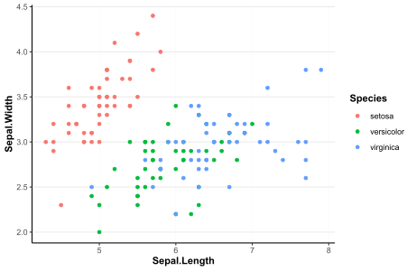

# ggypfs
R theme for YPFS publications

## installation
```
devtools::install_github("ypfs/ggypfs")
```

## usage
Begin with a `ggplot` object:
```
ggplot(iris) +
  geom_point(aes(Sepal.Length, Sepal.Width, col = Species))
```


Add the YPFS theme quickly with
```
ggplot(iris) +
  geom_point(aes(Sepal.Length, Sepal.Width, col = Species)) +
  theme_ypfs()
```


And change the color palette with
```
ggplot(iris) +
  geom_point(aes(Sepal.Length, Sepal.Width, col = Species)) +
  scale_color_ypfs_d() + #that's d for discrete!
  theme_ypfs()
```


Also works for continuous scales:
```
ggplot(iris) +
  geom_point(aes(Sepal.Length, Sepal.Width, col = Petal.Length)) +
  scale_color_ypfs_c("sequential") +
  theme_ypfs()
```


## palettes
### qualitative


Note that you can also use the qualitative palettes with `scale_*_ypfs_c`---though I'd only recommend this with `yale_blues`:


### sequential


### divergent


## method
Check the [brainstorming](github_resources/brainstorming.html) doc to understand the iteration and selection process for themes a bit better.
